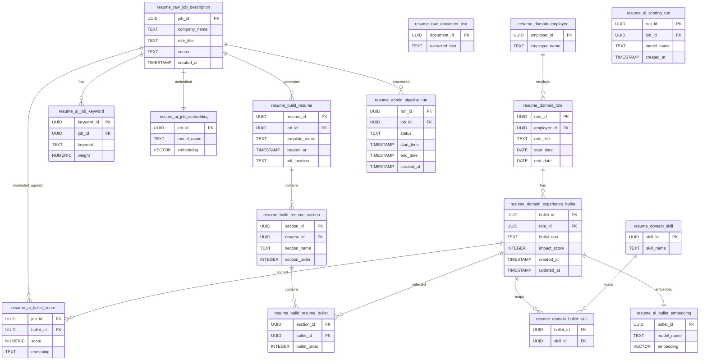

# AI Resume Tailor — ER Diagram



---

# Diagram Notes

## Core Flow

```text
Job → Keywords + Embedding → Bullet Scoring → Resume Build
```

---

## Key Relationships

### Career Data

* Employer → Role → Experience Bullet
* Bullet ↔ Skill (many-to-many)

---

### AI Layer

* Job → Keywords
* Job ↔ Bullet → Score
* Job → Embedding
* Bullet → Embedding

---

### Resume Construction

```text
Resume
   ↓
Sections
   ↓
Bullets (selected from experience)
```

---

### Pipeline Tracking

* Each job processed creates a `pipeline_run`
